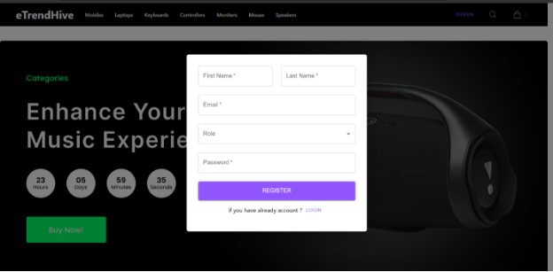
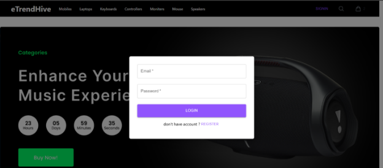
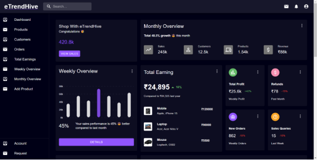
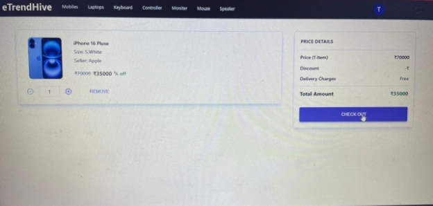
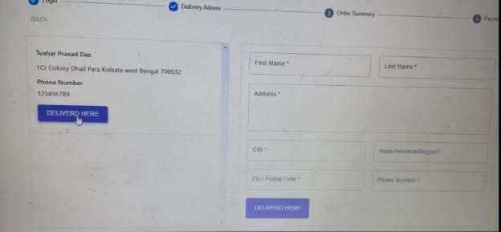
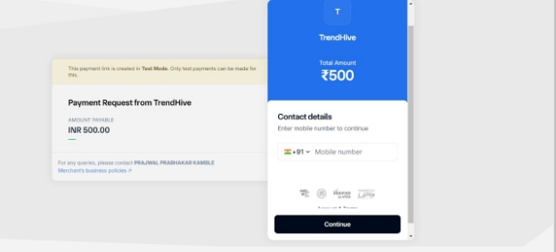

# **Full Stack Development Project (Group 2)**

* ## **Overview:**
- We have developed an E-Commerce platform for gamers and electronics enthusiasts using Java, Spring Boot in backend and React JS in frontend.

 

* ## **Key Features:**
  - CRUD Operations
  - Smooth User Experience
  - Admin Dashboard
  - Sign-in and Sign-up features

 

* ## **Participants:**
  + **Harsha:**
    - Creating Reusable Components: Develop modular React components for elements like navigation menus, product cards, search bars, and footers to ensure consistency and ease of maintenance.
    - Responsive Design: Ensure the platform adapts smoothly to various devices (mobile, tablet, desktop).
    - Managing Application State: Use tools like Redux, Context API to handle global states like user authentication, cart contents, and product lists.

  + **Uday:**
    - Creating Razorpay a secure payment gateway that enables businesses to accept online payments via 100+ methods, including cards, UPI, and wallets, with seamless integration support.
    - Creating payment module for e-commerce, integrate Razorpay APIs into your platform, authenticate transactions, and handle payment callbacks for order processing.
    - Created Review and Rating module which enables customers to post reviews, provide ratings, and retrieve aggregated feedback. These modules include CRUD operations, user authentication, and seamless API endpoints for managing feedback.
  
  + **Prajwal:**
    - **Product Module**: Designed API endpoints for managing product details, including CRUD operations and search functionality.
    - **User Module**: Implemented user registration, authentication, and profile management features.
    - **Cart Module**: Developed functionality to manage cart items, including adding, updating, and removing products.
    - **Order Module**: Created APIs for order creation, tracking, and handling payment status integration.

 

* ## **Project Execution Demo:**

* ### **Sign-Up Page**

 

* ### **Sign-In Page**

 

### **Home Page**

 

### **Admin Dashboard**

 

### **Product Page**

 

### **Order Page**

 

### **Payment Confirmation**

